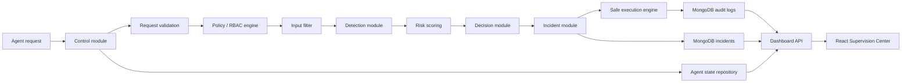

# Backend Optimization and Supervision Architecture

Ce document résume les améliorations réalisées sur le backend du projet afin de transformer le prototype initial en une base plus robuste, mesurable et exploitable dans un contexte de supervision SOC.

## 1. Objectif de l’optimisation

L’objectif principal était de renforcer la chaîne de supervision des agents IA sans modifier le principe général de l’application. Le système devait rester simple à démontrer, mais gagner en solidité sur les points importants :

- validation stricte des requêtes agents ;
- détection des comportements anormaux ;
- évaluation du niveau de risque ;
- réponse automatique aux incidents ;
- stockage MongoDB exploitable par le dashboard ;
- API backend stable pour la visualisation temps réel ;
- meilleure maintenabilité du code.

## 2. Architecture logique actuelle



Le backend est organisé autour d’un pipeline de contrôle. Chaque requête d’agent passe par plusieurs niveaux de décision avant exécution. Les résultats sont persistés dans MongoDB, puis exposés au dashboard via une API locale.

## 3. Optimisations réalisées

### 3.1 Risk scoring

Un module de scoring de risque a été ajouté afin d’éviter une classification binaire limitée à `NORMAL` ou `ANOMALY`.

Le système calcule maintenant :

- un score numérique entre 0 et 100 ;
- un niveau de risque : `LOW`, `MEDIUM`, `HIGH`, `CRITICAL` ;
- des facteurs de risque explicites ;
- la sensibilité de l’action demandée.

Cette information est stockée dans les logs et exploitée par les métriques de supervision.

### 3.2 Incident lifecycle

Le backend ne se contente plus de générer une alerte ponctuelle. Les anomalies importantes créent maintenant des incidents persistants dans MongoDB avec un cycle de vie opérationnel :

- `OPEN`
- `ACKNOWLEDGED`
- `RESOLVED`
- `FALSE_POSITIVE`

Chaque incident conserve un historique de changement de statut, ce qui rapproche l’application d’un outil réel de suivi SOC.

Les réponses automatiques utilisent également des niveaux de limitation
persistés dans `agent_states` : `NORMAL`, `WATCH`, `DEGRADED`, `RESTRICTED` et
`SUSPENDED`. Le niveau `DEGRADED` espace les requêtes, tandis que le niveau
`RESTRICTED` limite l'agent aux opérations à faible risque. Ces restrictions
restent actives après le redémarrage du backend.

### 3.3 Policy engine

Les règles RBAC sont conservées dans une collection MongoDB privée et versionnée.
Le fichier `config/policies.json` sert uniquement à initialiser une collection
vide ou comme solution de secours si MongoDB est indisponible. Ces règles ne
sont pas exposées par l'API du dashboard.

Cette approche permet de modifier les rôles, les actions autorisées, la sensibilité des actions et certaines politiques d’exécution sans réécrire le code Python.

Les rôles actuellement gérés incluent :

- `collector`
- `analyst`
- `writer`
- `executor`
- `admin`

### 3.4 Safe execution engine

L’exécution des actions a été renforcée pour éviter qu’un agent puisse produire un effet dangereux sur le système hôte.

Les contrôles ajoutés couvrent notamment :

- blocage des URLs locales ou privées pour les appels réseau ;
- restriction des chemins autorisés pour la lecture et l’écriture ;
- blocage des suppressions hors périmètre ;
- allowlist de commandes système ;
- détection de tokens de contrôle shell ;
- redirection sécurisée des écritures vers des dossiers autorisés.

Cette couche est importante parce qu’elle réduit le risque qu’un agent supervisé transforme une simple anomalie logique en action destructive.

### 3.5 Optimisation MongoDB et repositories

Les repositories ont été améliorés avec des indexes MongoDB adaptés aux usages du dashboard :

- tri par date ;
- filtrage par agent ;
- filtrage par action ;
- filtrage par sévérité ;
- filtrage par niveau de risque ;
- filtrage par statut de détection ;
- filtrage par incident ;
- filtrage des actions bloquées.

Des méthodes de requête filtrée ont également été ajoutées pour éviter de charger inutilement toute la collection.

### 3.6 Typed models internes

Une couche de modèles internes a été ajoutée dans `core/models.py`.

Elle formalise les objets importants du pipeline :

- `AgentRequest`
- `DetectionEvent`
- `DecisionMetadata`
- `IncidentResponse`

Cette optimisation réduit la dépendance à des dictionnaires libres et rend le backend plus maintenable. Elle permet aussi de mieux contrôler les erreurs de format avant qu’elles ne provoquent des incohérences dans le pipeline.

## 4. API de supervision

Le dashboard React consomme une API locale exposée par `dashboard/api_server.py`.

Endpoints principaux :

| Endpoint | Rôle |
| --- | --- |
| `GET /api/dashboard` | Charge la vue complète du dashboard |
| `GET /api/logs` | Récupère les logs filtrables |
| `GET /api/incidents` | Récupère les incidents filtrables |
| `GET /api/agents` | Récupère l’état des agents |
| `GET /api/metrics` | Récupère les métriques de supervision |
| `POST /api/agents/status` | Met à jour le statut d’un agent |
| `POST /api/incidents/status` | Met à jour le statut d’un incident |

Cette API permet au dashboard de fonctionner avec des données MongoDB live au lieu d’un mode démo statique.

## 5. Amélioration dashboard liée au backend

Le dashboard affiche maintenant les incidents persistés et permet de changer leur statut depuis la page Alerts. Cet ajout ne modifie pas le style visuel général ; il expose simplement une capacité backend déjà disponible.

La page Alerts montre donc deux niveaux :

1. les événements de sécurité issus des logs ;
2. le cycle de vie opérationnel des incidents.

Cela rend l’application plus crédible pour une démonstration de supervision, car l’utilisateur ne voit pas seulement une alerte : il peut suivre son traitement.

## 6. Validation

La validation technique actuelle couvre :

- compilation des modules backend ;
- tests unitaires du pipeline ;
- scénarios fonctionnels officiels ;
- validation des règles RBAC ;
- validation des anomalies de fréquence ;
- validation du blocage d’input malveillant ;
- validation des protections d’exécution ;
- validation du lifecycle incident ;
- validation des modèles typés.

Résultat de validation :

```text
python -m compileall core storage dashboard\api_server.py tests scenarios
OK

python -m unittest tests.test_system tests.test_scenarios -v
Ran 26 tests
OK
```

## 7. Apport pour le projet PFE

Ces optimisations montrent une évolution importante du projet :

- le système n’est plus seulement une preuve de concept ;
- les décisions de sécurité sont explicables ;
- les incidents sont persistés et suivis ;
- les politiques sont configurables ;
- les actions sensibles sont encadrées ;
- le dashboard affiche des données live ;
- l’architecture est plus facile à maintenir et à étendre.

Le projet peut donc être présenté comme une plateforme légère de supervision d’agents IA orientée sécurité, inspirée des pratiques SOC : collecte, détection, scoring, décision, réponse, journalisation et visualisation.

## 8. Limites restantes et perspectives

Les prochaines améliorations possibles sont :

- ajout d’une authentification pour protéger l’API dashboard ;
- pagination serveur pour les très grands volumes de logs ;
- websocket ou server-sent events pour du vrai streaming temps réel ;
- export CSV/PDF des incidents ;
- ajout de règles de corrélation multi-agents ;
- durcissement des tests d’intégration avec MongoDB réel ;
- enrichissement des métriques SOC comme MTTA, MTTR et taux de faux positifs.
